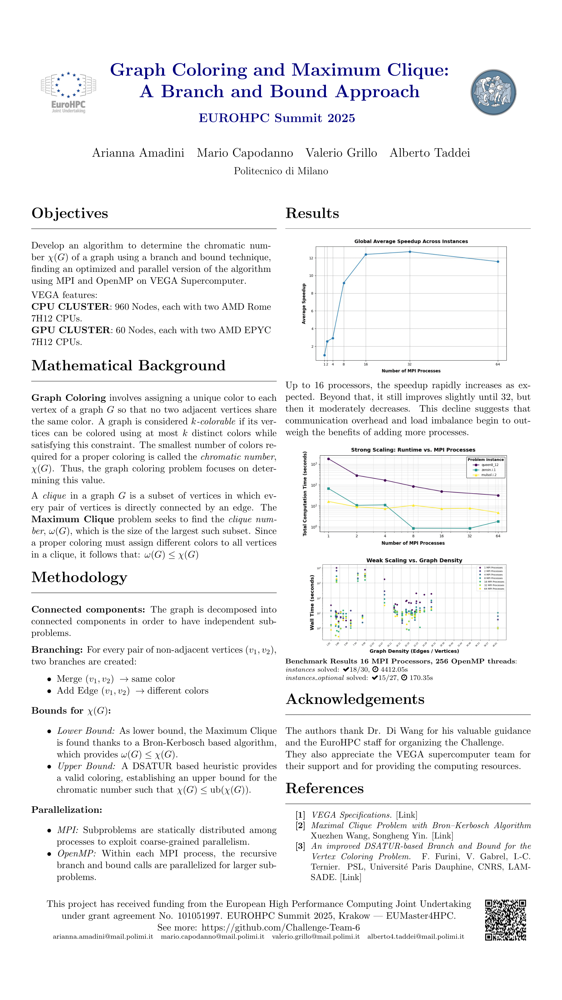

[](docs/poster.pdf)

## Overview

This project implements a parallel **Branch-and-Bound** algorithm for **Graph Coloring**, leveraging **MPI** and **OpenMP** to improve performance. The objective is to determine the **chromatic number** of a given graph while optimizing computational efficiency.

&nbsp;
## Features
- **Graph coloring using Branch-and-Bound**
- **Heuristics for clique and coloring estimation**
- **Parallel execution using MPI and OpenMP**
- **Benchmarking automation via `run_benchmarks.sh`**

&nbsp;
## Output Format
Each run generates an output file `<basename>.output` with details about the execution. The `.output` file contains:

- Unique problem instance name
- Number of vertices and edges
- Best solution found within the time limit
- Indicator if the solution is optimal
- Total computation time (including I/O)
- Resources used (number of cores and nodes)


Example of `.output` file

```sh
problem_instance_file_name: anna
cmd_line: <root>/EuroHPC_Student_Challenge_2025_Team_6/build/../build/bin/solver ../instances/anna.col 10000.0 
solver_version: v1.0.0
number_of_vertices: 138
number_of_edges: 493
time_limit_sec: 10000
number_of_mpi_processes: 1
number_of_threads_per_process: 256
wall_time_sec: 2.83112
is_within_time_limit: true
number_of_colors: 11
0 0
1 0
2 0
.. ..
```


&nbsp;
## Installation
### INSTALL.md
This file explains the installation and setup process.

&nbsp;
## **Team Members**
| Name | GitHub Account |
|------|---------------|
| **Alberto Taddei** | https://github.com/albtad01 |
| **Arianna Amadini** | https://github.com/AriannaAmadini |
| **Mario Capodanno** | https://github.com/MarioCapodanno |
| **Valerio Grillo** | https://github.com/Valegrl |


&nbsp;
# Benchmarking Optimal Solutions with 16 MPI Processes and 256 OpenMP Threads per Process

## instances

| Index | Instance    | Wall Time (sec) | Colors | Cumulative Time (sec) |
|-------|-------------|-----------------|--------|-----------------------|
| 1     | anna        | 0.583549        | 11     | 0.583549              |
| 2     | david       | 15.016300       | 11     | 15.599849             |
| 3     | fpsol2.i.1  | 12.981200       | 65     | 28.581049             |
| 4     | games120    | 5.874300        | 9      | 34.455349             |
| 5     | homer       | 7.142530        | 13     | 41.597879             |
| 6     | huck        | 0.919095        | 11     | 42.516974             |
| 7     | inithx.i.3  | 1.101950        | 31     | 43.618924             |
| 8     | jean        | 0.663839        | 10     | 44.282763             |
| 9     | miles1500   | 1.078930        | 73     | 45.361693             |
| 10    | miles250    | 9.410330        | 8      | 54.772023             |
| 11    | mulsol.i.1  | 0.751244        | 49     | 55.523267             |
| 12    | myciel3     | 6.033320        | 4      | 61.556587             |
| 13    | myciel4     | 1399.080000     | 5      | 1460.636587           |
| 14    | queen5_5    | 1.008740        | 5      | 1461.645327           |
| 15    | queen6_6    | 1323.990000     | 7      | 2785.635327           |
| 16    | queen7_7    | 1576.720000     | 7      | 4362.355327           |
| 17    | queen8_12   | 48.866200       | 12     | 4411.221527           |
| 18    | zeroin.i.1  | 0.833230        | 49     | 4412.054757           |


18 out of 30

&nbsp;
## instances_optional

| Index       | Instance     | Wall Time (sec) | Colors | Cumulative Time (sec) |
|-------------|--------------|-----------------|--------|-----------------------|
| 1           | fpsol2.i.2   | 13.45350        | 30     | 13.45350              |
| 2           | fpsol2.i.3   | 13.50430        | 30     | 26.95780              |
| 3           | inithx.i.1   | 15.71330        | 54     | 42.67110              |
| 4           | inithx.i.2   | 11.11510        | 31     | 53.78620              |
| 5           | le450_25a    | 6.96311         | 25     | 60.74931              |
| 6           | le450_25b    | 7.58611         | 25     | 68.33542              |
| 7           | miles1000    | 15.58270        | 42     | 83.91812              |
| 8           | miles500     | 5.61099         | 20     | 89.52911              |
| 9           | miles750     | 30.01960        | 31     | 119.54871             |
| 10          | mulsol.i.2   | 7.31242         | 31     | 126.86113             |
| 11          | mulsol.i.3   | 7.44054         | 31     | 134.30167             |
| 12          | mulsol.i.4   | 4.80688         | 31     | 139.10855             |
| 13          | mulsol.i.5   | 10.12970        | 31     | 149.23825             |
| 14          | zeroin.i.2   | 10.37460        | 30     | 159.61285             |
| 15          | zeroin.i.3   | 10.74100        | 30     | 170.35385             |


15 out of 27

&nbsp;
### Total time:
#### 4,582.408607s out of 10,000s

&nbsp;
## Benchmarks outcome
### instances

| Index | Instance    | MPI Processes | Threads per Process | Wall Time (sec) | Within Time Limit | Colors |
|-------|-------------|---------------|---------------------|-----------------|-------------------|--------|
| 0     | anna        | 1             | 256                 | 2.831120        | True              | 11     |
| 1     | anna        | 2             | 256                 | 9.666300        | True              | 11     |
| 2     | anna        | 4             | 256                 | 1.178040        | True              | 11     |
| 3     | anna        | 8             | 256                 | 1.351680        | True              | 11     |
| 4     | anna        | 16            | 256                 | 0.583549        | True              | 11     |
| 5     | anna        | 32            | 256                 | 2.283050        | True              | 11     |
| 6     | anna        | 64            | 256                 | 0.272818        | True              | 11     |
| 7     | david       | 1             | 256                 | 3.354640        | True              | 11     |
| 8     | david       | 2             | 256                 | 4.509680        | True              | 11     |
| 9     | david       | 4             | 256                 | 9.302380        | True              | 11     |
| 10    | david       | 8             | 256                 | 8.908540        | True              | 11     |
| 11    | david       | 16            | 256                 | 15.016300       | True              | 11     |
| 12    | david       | 32            | 256                 | 6.051990        | True              | 11     |
| 13    | david       | 64            | 256                 | 3.427940        | True              | 11     |
| 14    | fpsol2.i.1  | 1             | 256                 | 165.397000      | True              | 65     |
| 15    | fpsol2.i.1  | 2             | 256                 | 23.228500       | True              | 65     |
| 16    | fpsol2.i.1  | 4             | 256                 | 22.509600       | True              | 65     |
| 17    | fpsol2.i.1  | 8             | 256                 | 12.292500       | True              | 65     |
| 18    | fpsol2.i.1  | 16            | 256                 | 12.981200       | True              | 65     |
| 19    | fpsol2.i.1  | 32            | 256                 | 15.608100       | True              | 65     |
| 20    | games120    | 1             | 256                 | 3.171430        | True              | 9      |
| 21    | games120    | 2             | 256                 | 1.212590        | True              | 9      |
| 22    | games120    | 4             | 256                 | 4.690170        | True              | 9      |
| 23    | games120    | 8             | 256                 | 9.225240        | True              | 9      |
| 24    | games120    | 16            | 256                 | 5.874300        | True              | 9      |
| 25    | games120    | 64            | 256                 | 4.972540        | True              | 9      |
| 26    | homer       | 1             | 256                 | 12.404300       | True              | 13     |
| 27    | homer       | 2             | 256                 | 5.849120        | True              | 13     |
| 28    | homer       | 4             | 256                 | 13.593000       | True              | 13     |
| 29    | homer       | 8             | 256                 | 1.364750        | True              | 13     |
| 30    | homer       | 16            | 256                 | 7.142530        | True              | 13     |
| 31    | homer       | 32            | 256                 | 0.322793        | True              | 13     |
| 32    | homer       | 64            | 256                 | 1.747400        | True              | 13     |
| 33    | huck        | 1             | 256                 | 5.437440        | True              | 11     |
| 34    | huck        | 2             | 256                 | 4.893160        | True              | 11     |
| 35    | huck        | 4             | 256                 | 12.129000       | True              | 11     |
| 36    | huck        | 8             | 256                 | 9.783580        | True              | 11     |
| 37    | huck        | 16            | 256                 | 0.919095        | True              | 11     |
| 38    | huck        | 32            | 256                 | 0.941270        | True              | 11     |
| 39    | huck        | 64            | 256                 | 11.496900       | True              | 11     |
| 40    | inithx.i.3  | 1             | 256                 | 50.992900       | True              | 31     |
| 41    | inithx.i.3  | 2             | 256                 | 14.731100       | True              | 31     |
| 42    | inithx.i.3  | 4             | 256                 | 12.932900       | True              | 31     |
| 43    | inithx.i.3  | 8             | 256                 | 21.085900       | True              | 31     |
| 44    | inithx.i.3  | 16            | 256                 | 1.101950        | True              | 31     |
| 45    | inithx.i.3  | 32            | 256                 | 11.343400       | True              | 31     |
| 46    | inithx.i.3  | 64            | 256                 | 13.115400       | True              | 31     |
| 47    | jean        | 1             | 256                 | 6.118430        | True              | 10     |
| 48    | jean        | 2             | 256                 | 5.409430        | True              | 10     |
| 49    | jean        | 4             | 256                 | 9.411790        | True              | 10     |
| 50    | jean        | 8             | 256                 | 9.523040        | True              | 10     |
| 51    | jean        | 16            | 256                 | 0.663839        | True              | 10     |
| 52    | jean        | 32            | 256                 | 8.887430        | True              | 10     |
| 53    | jean        | 64            | 256                 | 9.572950        | True              | 10     |
| 54    | le450_5b    | 2             | 256                 | 10001.000000    | False             | 10     |
| 55    | le450_5b    | 4             | 256                 | 10000.300000    | False             | 10     |
| 56    | le450_5b    | 8             | 256                 | 10000.500000    | False             | 10     |
| 57    | le450_5b    | 16            | 256                 | 10000.300000    | False             | 10     |
| 58    | le450_5b    | 32            | 256                 | 10000.400000    | False             | 10     |
| 59    | le450_5b    | 64            | 256                 | 10000.700000    | False             | 10     |
| 60    | miles1500   | 1             | 256                 | 3.685840        | True              | 73     |
| 61    | miles1500   | 2             | 256                 | 3.648050        | True              | 73     |
| 62    | miles1500   | 4             | 256                 | 6.155420        | True              | 73     |
| 63    | miles1500   | 8             | 256                 | 10.499400       | True              | 73     |
| 64    | miles1500   | 16            | 256                 | 1.078930        | True              | 73     |
| 65    | miles1500   | 32            | 256                 | 0.920079        | True              | 73     |
| 66    | miles1500   | 64            | 256                 | 1.027600        | True              | 73     |
| 67    | miles250    | 1             | 256                 | 11.097100       | True              | 8      |
| 68    | miles250    | 2             | 256                 | 6.261160        | True              | 8      |
| 69    | miles250    | 4             | 256                 | 4.894980        | True              | 8      |
| 70    | miles250    | 8             | 256                 | 9.090220        | True              | 8      |
| 71    | miles250    | 16            | 256                 | 9.410330        | True              | 8      |
| 72    | miles250    | 32            | 256                 | 4.086680        | True              | 8      |
| 73    | miles250    | 64            | 256                 | 1.705000        | True              | 8      |
| 74    | mulsol.i.1  | 1             | 256                 | 48.274400       | True              | 49     |
| 75    | mulsol.i.1  | 2             | 256                 | 13.515400       | True              | 49     |
| 76    | mulsol.i.1  | 4             | 256                 | 12.627700       | True              | 49     |
| 77    | mulsol.i.1  | 8             | 256                 | 12.639600       | True              | 49     |
| 78    | mulsol.i.1  | 16            | 256                 | 0.751244        | True              | 49     |
| 79    | mulsol.i.1  | 32            | 256                 | 2.818180        | True              | 49     |
| 80    | mulsol.i.1  | 64            | 256                 | 9.226510        | True              | 49     |
| 81    | myciel3     | 1             | 256                 | 32.552300       | True              | 4      |
| 82    | myciel3     | 2             | 256                 | 14.079100       | True              | 4      |
| 83    | myciel3     | 4             | 256                 | 14.446400       | True              | 4      |
| 84    | myciel3     | 8             | 256                 | 1.627790        | True              | 4      |
| 85    | myciel3     | 16            | 256                 | 6.033320        | True              | 4      |
| 86    | myciel3     | 32            | 256                 | 1.441370        | True              | 4      |
| 87    | myciel3     | 64            | 256                 | 0.760713        | True              | 4      |
| 88    | myciel4     | 1             | 256                 | 10000.100000    | False             | 5      |
| 89    | myciel4     | 2             | 256                 | 6556.800000     | True              | 5      |
| 90    | myciel4     | 4             | 256                 | 1715.460000     | True              | 5      |
| 91    | myciel4     | 8             | 256                 | 2816.720000     | True              | 5      |
| 92    | myciel4     | 16            | 256                 | 1399.080000     | True              | 5      |
| 93    | myciel4     | 32            | 256                 | 1142.020000     | True              | 5      |
| 94    | myciel4     | 64            | 256                 | 1871.880000     | True              | 5      |
| 95    | myciel5     | 1             | 256                 | 10003.000000    | False             | 6      |
| 96    | myciel5     | 2             | 256                 | 10000.100000    | False             | 6      |
| 97    | myciel5     | 4             | 256                 | 10000.100000    | False             | 6      |
| 98    | myciel5     | 8             | 256                 | 10000.900000    | False             | 6      |
| 99    | myciel5     | 16            | 256                 | 10000.200000    | False             | 6      |
| 100   | myciel5     | 32            | 256                 | 10000.300000    | False             | 6      |
| 101   | myciel7     | 1             | 256                 | 10002.200000    | False             | 8      |
| 102   | myciel7     | 2             | 256                 | 10000.200000    | False             | 8      |
| 103   | myciel7     | 4             | 256                 | 10000.100000    | False             | 8      |
| 104   | myciel7     | 8             | 256                 | 10000.200000    | False             | 8      |
| 105   | myciel7     | 16            | 256                 | 10000.900000    | False             | 8      |
| 106   | myciel7     | 32            | 256                 | 10000.200000    | False             | 8      |
| 107   | queen10_10  | 1             | 256                 | 10002.200000    | False             | 13     |
| 108   | queen10_10  | 2             | 256                 | 10000.200000    | False             | 13     |
| 109   | queen10_10  | 4             | 256                 | 10000.200000    | False             | 12     |
| 110   | queen10_10  | 8             | 256                 | 10000.400000    | False             | 12     |
| 111   | queen10_10  | 16            | 256                 | 10000.500000    | False             | 12     |
| 112   | queen10_10  | 32            | 256                 | 10000.300000    | False             | 12     |
| 113   | queen10_10  | 64            | 256                 | 10000.700000    | False             | 12     |
| 114   | queen11_11  | 1             | 256                 | 10002.300000    | False             | 14     |
| 115   | queen11_11  | 2             | 256                 | 10000.300000    | False             | 14     |
| 116   | queen11_11  | 4             | 256                 | 10000.100000    | False             | 13     |
| 117   | queen11_11  | 8             | 256                 | 10000.200000    | False             | 14     |
| 118   | queen11_11  | 16            | 256                 | 10000.600000    | False             | 13     |
| 119   | queen11_11  | 32            | 256                 | 10000.600000    | False             | 14     |
| 120   | queen11_11  | 64            | 256                 | 10000.200000    | False             | 14     |
| 121   | queen12_12  | 1             | 256                 | 10002.600000    | False             | 16     |
| 122   | queen12_12  | 2             | 256                 | 10000.200000    | False             | 15     |
| 123   | queen12_12  | 4             | 256                 | 10000.100000    | False             | 15     |
| 124   | queen12_12  | 8             | 256                 | 10000.400000    | False             | 15     |
| 125   | queen12_12  | 32            | 256                 | 10000.400000    | False             | 15     |
| 126   | queen12_12  | 64            | 256                 | 10000.500000    | False             | 15     |
| 127   | queen13_13  | 1             | 256                 | 10003.100000    | False             | 17     |
| 128   | queen13_13  | 2             | 256                 | 10000.800000    | False             | 17     |
| 129   | queen13_13  | 4             | 256                 | 10000.300000    | False             | 17     |
| 130   | queen13_13  | 8             | 256                 | 10000.200000    | False             | 17     |
| 131   | queen13_13  | 16            | 256                 | 10000.300000    | False             | 17     |
| 132   | queen13_13  | 32            | 256                 | 10000.300000    | False             | 17     |
| 133   | queen14_14  | 1             | 256                 | 10002.300000    | False             | 18     |
| 134   | queen14_14  | 2             | 256                 | 10000.900000    | False             | 18     |
| 135   | queen14_14  | 4             | 256                 | 10000.400000    | False             | 18     |
| 136   | queen14_14  | 8             | 256                 | 10000.200000    | False             | 18     |
| 137   | queen14_14  | 16            | 256                 | 10000.300000    | False             | 18     |
| 138   | queen14_14  | 32            | 256                 | 10000.300000    | False             | 18     |
| 139   | queen14_14  | 64            | 256                 | 10000.700000    | False             | 18     |
| 140   | queen15_15  | 1             | 256                 | 10002.200000    | False             | 20     |
| 141   | queen15_15  | 2             | 256                 | 10000.900000    | False             | 19     |
| 142   | queen15_15  | 4             | 256                 | 10000.200000    | False             | 19     |
| 143   | queen15_15  | 8             | 256                 | 10000.500000    | False             | 19     |
| 144   | queen15_15  | 16            | 256                 | 10000.800000    | False             | 19     |
| 145   | queen15_15  | 32            | 256                 | 10000.300000    | False             | 19     |
| 146   | queen15_15  | 64            | 256                 | 10000.400000    | False             | 19     |
| 147   | queen5_5    | 1             | 256                 | 3.309270        | True              | 5      |
| 148   | queen5_5    | 2             | 256                 | 14.462900       | True              | 5      |
| 149   | queen5_5    | 4             | 256                 | 2.015740        | True              | 5      |
| 150   | queen5_5    | 8             | 256                 | 1.394300        | True              | 5      |
| 151   | queen5_5    | 16            | 256                 | 1.008740        | True              | 5      |
| 152   | queen5_5    | 32            | 256                 | 2.452500        | True              | 5      |
| 153   | queen5_5    | 64            | 256                 | 1.536890        | True              | 5      |
| 154   | queen6_6    | 1             | 256                 | 4331.910000     | True              | 7      |
| 155   | queen6_6    | 2             | 256                 | 2068.780000     | True              | 7      |
| 156   | queen6_6    | 4             | 256                 | 4274.440000     | True              | 7      |
| 157   | queen6_6    | 8             | 256                 | 1867.000000     | True              | 7      |
| 158   | queen6_6    | 16            | 256                 | 1323.990000     | True              | 7      |
| 159   | queen6_6    | 32            | 256                 | 3316.220000     | True              | 7      |
| 160   | queen7_7    | 1             | 256                 | 7591.180000     | True              | 7      |
| 161   | queen7_7    | 2             | 256                 | 2942.340000     | True              | 7      |
| 162   | queen7_7    | 4             | 256                 | 4119.200000     | True              | 7      |
| 163   | queen7_7    | 8             | 256                 | 3269.300000     | True              | 7      |
| 164   | queen7_7    | 16            | 256                 | 1576.720000     | True              | 7      |
| 165   | queen7_7    | 32            | 256                 | 2486.450000     | True              | 7      |
| 166   | queen7_7    | 64            | 256                 | 3869.300000     | True              | 7      |
| 167   | queen8_12   | 1             | 256                 | 1774.160000     | True              | 12     |
| 168   | queen8_12   | 2             | 256                 | 284.779000      | True              | 12     |
| 169   | queen8_12   | 4             | 256                 | 167.984000      | True              | 12     |
| 170   | queen8_12   | 8             | 256                 | 85.595600       | True              | 12     |
| 171   | queen8_12   | 16            | 256                 | 48.866200       | True              | 12     |
| 172   | queen8_12   | 64            | 256                 | 31.742100       | True              | 12     |
| 173   | queen8_8    | 1             | 256                 | 10002.300000    | False             | 10     |
| 174   | queen8_8    | 2             | 256                 | 9999.820000     | True              | 9      |
| 175   | queen8_8    | 4             | 256                 | 10000.500000    | True              | 9      |
| 176   | queen8_8    | 8             | 256                 | 10000.400000    | True              | 9      |
| 177   | queen8_8    | 16            | 256                 | 10000.300000    | False             | 10     |
| 178   | queen8_8    | 32            | 256                 | 10000.200000    | True              | 9      |
| 179   | queen8_8    | 64            | 256                 | 10000.500000    | True              | 9      |
| 180   | queen9_9    | 1             | 256                 | 10001.900000    | False             | 11     |
| 181   | queen9_9    | 2             | 256                 | 10000.300000    | False             | 10     |
| 182   | queen9_9    | 4             | 256                 | 10000.200000    | False             | 10     |
| 183   | queen9_9    | 8             | 256                 | 10000.100000    | False             | 10     |
| 184   | queen9_9    | 16            | 256                 | 10000.100000    | False             | 10     |
| 185   | queen9_9    | 64            | 256                 | 10000.100000    | False             | 10     |
| 186   | school1     | 8             | 256                 | 10072.900000    | False             | 29     |
| 187   | school1     | 16            | 256                 | 10081.600000    | False             | 29     |
| 188   | school1     | 32            | 256                 | 10064.400000    | False             | 29     |
| 189   | zeroin.i.1  | 1             | 256                 | 67.076900       | True              | 49     |
| 190   | zeroin.i.1  | 2             | 256                 | 10.521200       | True              | 49     |
| 191   | zeroin.i.1  | 4             | 256                 | 11.100300       | True              | 49     |
| 192   | zeroin.i.1  | 8             | 256                 | 0.844417        | True              | 49     |
| 193   | zeroin.i.1  | 32            | 256                 | 0.833230        | True              | 49     |
| 194   | zeroin.i.1  | 64            | 256                 | 1.778100        | True              | 49     |


&nbsp;
### instances_optional
| Index | Instance     | MPI Processes | Threads per Process | Wall Time (sec) | Within Time Limit | Colors |
|-------|--------------|---------------|---------------------|-----------------|-------------------|--------|
| 0     | fpsol2.i.2   | 1             | 256                 | 61.63380        | True              | 30     |
| 1     | fpsol2.i.2   | 2             | 256                 | 17.29340        | True              | 30     |
| 2     | fpsol2.i.2   | 4             | 256                 | 11.55750        | True              | 30     |
| 3     | fpsol2.i.2   | 8             | 256                 | 16.08670        | True              | 30     |
| 4     | fpsol2.i.2   | 16            | 256                 | 13.45350        | True              | 30     |
| 5     | fpsol2.i.2   | 32            | 256                 | 8.16692         | True              | 30     |
| 6     | fpsol2.i.2   | 64            | 256                 | 7.36674         | True              | 30     |
| 7     | fpsol2.i.3   | 1             | 256                 | 46.28510        | True              | 30     |
| 8     | fpsol2.i.3   | 2             | 256                 | 9.94497         | True              | 30     |
| 9     | fpsol2.i.3   | 4             | 256                 | 8.52328         | True              | 30     |
| 10    | fpsol2.i.3   | 8             | 256                 | 10.47860        | True              | 30     |
| 11    | fpsol2.i.3   | 16            | 256                 | 13.50430        | True              | 30     |
| 12    | fpsol2.i.3   | 32            | 256                 | 7.88846         | True              | 30     |
| 13    | inithx.i.1   | 1             | 256                 | 204.70500       | True              | 54     |
| 14    | inithx.i.1   | 2             | 256                 | 44.42050        | True              | 54     |
| 15    | inithx.i.1   | 4             | 256                 | 16.82530        | True              | 54     |
| 16    | inithx.i.1   | 8             | 256                 | 25.03310        | True              | 54     |
| 17    | inithx.i.1   | 16            | 256                 | 15.71330        | True              | 54     |
| 18    | inithx.i.1   | 32            | 256                 | 13.04420        | True              | 54     |
| 19    | inithx.i.2   | 1             | 256                 | 61.03930        | True              | 31     |
| 20    | inithx.i.2   | 2             | 256                 | 12.33090        | True              | 31     |
| 21    | inithx.i.2   | 4             | 256                 | 11.39340        | True              | 31     |
| 22    | inithx.i.2   | 8             | 256                 | 15.57990        | True              | 31     |
| 23    | inithx.i.2   | 16            | 256                 | 11.11510        | True              | 31     |
| 24    | le450_15a    | 4             | 256                 | 10000.50000     | False             | 16     |
| 25    | le450_15a    | 8             | 256                 | 10000.60000     | False             | 16     |
| 26    | le450_15a    | 16            | 256                 | 10000.70000     | False             | 16     |
| 27    | le450_15a    | 32            | 256                 | 10000.50000     | False             | 16     |
| 28    | le450_15a    | 64            | 256                 | 10000.70000     | False             | 16     |
| 29    | le450_15b    | 4             | 256                 | 10000.50000     | False             | 16     |
| 30    | le450_15b    | 8             | 256                 | 10000.60000     | False             | 16     |
| 31    | le450_15b    | 16            | 256                 | 10000.60000     | False             | 16     |
| 32    | le450_15b    | 32            | 256                 | 10000.60000     | False             | 16     |
| 33    | le450_15b    | 64            | 256                 | 10000.60000     | False             | 16     |
| 34    | le450_15c    | 4             | 256                 | 10001.30000     | False             | 24     |
| 35    | le450_15c    | 8             | 256                 | 10001.30000     | False             | 24     |
| 36    | le450_15c    | 16            | 256                 | 10001.50000     | False             | 24     |
| 37    | le450_15c    | 32            | 256                 | 10001.50000     | False             | 24     |
| 38    | le450_15d    | 4             | 256                 | 10002.60000     | False             | 23     |
| 39    | le450_15d    | 8             | 256                 | 10001.60000     | False             | 23     |
| 40    | le450_15d    | 16            | 256                 | 10002.60000     | False             | 23     |
| 41    | le450_15d    | 32            | 256                 | 10001.60000     | False             | 23     |
| 42    | le450_15d    | 64            | 256                 | 10001.20000     | False             | 23     |
| 43    | le450_25a    | 1             | 256                 | 7.01781         | True              | 25     |
| 44    | le450_25a    | 2             | 256                 | 6.93015         | True              | 25     |
| 45    | le450_25a    | 4             | 256                 | 2.92598         | True              | 25     |
| 46    | le450_25a    | 8             | 256                 | 9.71740         | True              | 25     |
| 47    | le450_25a    | 16            | 256                 | 6.96311         | True              | 25     |
| 48    | le450_25a    | 32            | 256                 | 4.33562         | True              | 25     |
| 49    | le450_25b    | 1             | 256                 | 7.01981         | True              | 25     |
| 50    | le450_25b    | 2             | 256                 | 2.14268         | True              | 25     |
| 51    | le450_25b    | 4             | 256                 | 3.56686         | True              | 25     |
| 52    | le450_25b    | 8             | 256                 | 9.35911         | True              | 25     |
| 53    | le450_25b    | 16            | 256                 | 7.58611         | True              | 25     |
| 54    | le450_25b    | 32            | 256                 | 11.80220        | True              | 25     |
| 55    | le450_5a     | 2             | 256                 | 10001.30000     | False             | 10     |
| 56    | le450_5a     | 4             | 256                 | 10000.30000     | False             | 10     |
| 57    | le450_5a     | 8             | 256                 | 10000.50000     | False             | 10     |
| 58    | le450_5a     | 16            | 256                 | 10000.40000     | False             | 10     |
| 59    | le450_5a     | 32            | 256                 | 10000.30000     | False             | 10     |
| 60    | le450_5a     | 64            | 256                 | 10000.30000     | False             | 10     |
| 61    | le450_5c     | 2             | 256                 | 510.42300       | True              | 5      |
| 62    | le450_5c     | 4             | 256                 | 10000.30000     | True              | 5      |
| 63    | le450_5c     | 8             | 256                 | 10000.40000     | True              | 5      |
| 64    | le450_5c     | 16            | 256                 | 10000.40000     | True              | 5      |
| 65    | le450_5c     | 32            | 256                 | 10000.30000     | True              | 5      |
| 66    | le450_5d     | 2             | 256                 | 547.80600       | True              | 5      |
| 67    | le450_5d     | 4             | 256                 | 10000.30000     | True              | 5      |
| 68    | le450_5d     | 8             | 256                 | 10000.40000     | True              | 5      |
| 69    | le450_5d     | 16            | 256                 | 10000.40000     | True              | 5      |
| 70    | le450_5d     | 32            | 256                 | 10000.40000     | True              | 5      |
| 71    | miles1000    | 1             | 256                 | 189.67900       | True              | 42     |
| 72    | miles1000    | 2             | 256                 | 51.97930        | True              | 42     |
| 73    | miles1000    | 4             | 256                 | 25.77780        | True              | 42     |
| 74    | miles1000    | 8             | 256                 | 68.71020        | True              | 42     |
| 75    | miles1000    | 16            | 256                 | 15.58270        | True              | 42     |
| 76    | miles1000    | 64            | 256                 | 19.10160        | True              | 42     |
| 77    | miles500     | 1             | 256                 | 5.63714         | True              | 20     |
| 78    | miles500     | 2             | 256                 | 6.90468         | True              | 20     |
| 79    | miles500     | 4             | 256                 | 2.34719         | True              | 20     |
| 80    | miles500     | 8             | 256                 | 5.59225         | True              | 20     |
| 81    | miles500     | 16            | 256                 | 5.61099         | True              | 20     |
| 82    | miles500     | 64            | 256                 | 4.43952         | True              | 20     |
| 83    | miles750     | 1             | 256                 | 23.29990        | True              | 31     |
| 84    | miles750     | 2             | 256                 | 19.07820        | True              | 31     |
| 85    | miles750     | 4             | 256                 | 11.92560        | True              | 31     |
| 86    | miles750     | 8             | 256                 | 16.97310        | True              | 31     |
| 87    | miles750     | 16            | 256                 | 30.01960        | True              | 31     |
| 88    | miles750     | 32            | 256                 | 16.75180        | True              | 31     |
| 89    | mulsol.i.2   | 1             | 256                 | 16.05230        | True              | 31     |
| 90    | mulsol.i.2   | 2             | 256                 | 8.87010         | True              | 31     |
| 91    | mulsol.i.2   | 4             | 256                 | 7.31614         | True              | 31     |
| 92    | mulsol.i.2   | 8             | 256                 | 10.56910        | True              | 31     |
| 93    | mulsol.i.2   | 16            | 256                 | 7.31242         | True              | 31     |
| 94    | mulsol.i.2   | 32            | 256                 | 7.64149         | True              | 31     |
| 95    | mulsol.i.2   | 64            | 256                 | 4.69194         | True              | 31     |
| 96    | mulsol.i.3   | 1             | 256                 | 10.97170        | True              | 31     |
| 97    | mulsol.i.3   | 2             | 256                 | 8.29819         | True              | 31     |
| 98    | mulsol.i.3   | 4             | 256                 | 5.27943         | True              | 31     |
| 99    | mulsol.i.3   | 8             | 256                 | 10.52900        | True              | 31     |
| 100   | mulsol.i.3   | 16            | 256                 | 7.44054         | True              | 31     |
| 101   | mulsol.i.3   | 64            | 256                 | 6.47482         | True              | 31     |
| 102   | mulsol.i.4   | 1             | 256                 | 12.79640        | True              | 31     |
| 103   | mulsol.i.4   | 2             | 256                 | 8.07961         | True              | 31     |
| 104   | mulsol.i.4   | 4             | 256                 | 3.40781         | True              | 31     |
| 105   | mulsol.i.4   | 8             | 256                 | 7.40275         | True              | 31     |
| 106   | mulsol.i.4   | 16            | 256                 | 4.80688         | True              | 31     |
| 107   | mulsol.i.4   | 32            | 256                 | 8.28211         | True              | 31     |
| 108   | mulsol.i.5   | 1             | 256                 | 12.89190        | True              | 31     |
| 109   | mulsol.i.5   | 2             | 256                 | 8.45557         | True              | 31     |
| 110   | mulsol.i.5   | 4             | 256                 | 6.43328         | True              | 31     |
| 111   | mulsol.i.5   | 8             | 256                 | 10.51580        | True              | 31     |
| 112   | mulsol.i.5   | 16            | 256                 | 10.12970        | True              | 31     |
| 113   | mulsol.i.5   | 32            | 256                 | 6.04432         | True              | 31     |
| 114   | mulsol.i.5   | 64            | 256                 | 6.15596         | True              | 31     |
| 115   | myciel6     | 1             | 256                 | 10000.10000     | False             | 7      |
| 116   | myciel6     | 2             | 256                 | 10000.10000     | False             | 7      |
| 117   | myciel6     | 4             | 256                 | 10000.10000     | False             | 7      |
| 118   | myciel6     | 8             | 256                 | 10000.10000     | False             | 7      |
| 119   | myciel6     | 16            | 256                 | 10000.10000     | False             | 7      |
| 120   | myciel6     | 64            | 256                 | 10000.10000     | False             | 7      |
| 121   | queen16_16  | 2             | 256                 | 10000.70000     | False             | 20     |
| 122   | queen16_16  | 4             | 256                 | 10000.30000     | False             | 20     |
| 123   | queen16_16  | 8             | 256                 | 10000.20000     | False             | 20     |
| 124   | queen16_16  | 16            | 256                 | 10000.30000     | False             | 20     |
| 125   | queen16_16  | 32            | 256                 | 10000.30000     | False             | 20     |
| 126   | queen16_16  | 64            | 256                 | 10000.30000     | False             | 20     |
| 127   | zeroin.i.2   | 1             | 256                 | 39.17890        | True              | 30     |
| 128   | zeroin.i.2   | 2             | 256                 | 14.50310        | True              | 30     |
| 129   | zeroin.i.2   | 4             | 256                 | 10.97050        | True              | 30     |
| 130   | zeroin.i.2   | 8             | 256                 | 14.36730        | True              | 30     |
| 131   | zeroin.i.2   | 16            | 256                 | 10.37460        | True              | 30     |
| 132   | zeroin.i.2   | 32            | 256                 | 12.82700        | True              | 30     |
| 133   | zeroin.i.2   | 64            | 256                 | 6.12948         | True              | 30     |
| 134   | zeroin.i.3   | 1             | 256                 | 35.87730        | True              | 30     |
| 135   | zeroin.i.3   | 2             | 256                 | 12.84560        | True              | 30     |
| 136   | zeroin.i.3   | 4             | 256                 | 8.07518         | True              | 30     |
| 137   | zeroin.i.3   | 8             | 256                 | 12.22500        | True              | 30     |
| 138   | zeroin.i.3   | 16            | 256                 | 10.74100        | True              | 30     |
| 139   | zeroin.i.3   | 32            | 256                 | 12.53780        | True              | 30     |
| 140   | zeroin.i.3   | 64            | 256                 | 6.38595         | True              | 30     |
